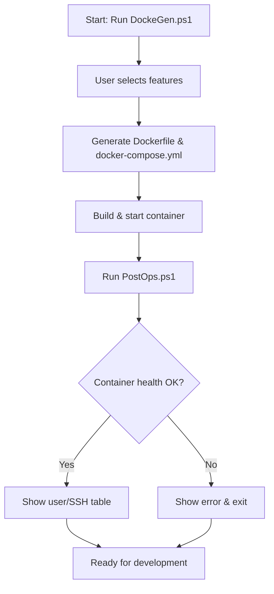

# DockGen Project Flowchart

```mermaid
graph TD
    A[Start: Run DockeGen.ps1] --> B[User selects features]
    B --> C[Generate Dockerfile & docker-compose.yml]
    C --> D[Build & start container]
    D --> E[Run PostOps.ps1]
    E --> F{Container health OK?}
    F -- Yes --> G[Show user/SSH table]
    F -- No --> H[Show error & exit]
    G --> I[Ready for development]
    H --> I
```

---
This flowchart describes the main workflow for DockGen from project generation to post-ops checks.
